# Time Series Analysis with Pandas

As a bona fide FinTech professional, you might find yourself looking into home values in a given market, the profit margins of a hot new start-up or the growth trends of a freshly-minted cryptocurrency. Making informed decisions about where to invest requires powerful tools that can drive a high volume of calucations in a short amount of time—and that's where Pandas comes in.


### Table of Contents
<ol>
    <li><a href="#background">Background</a></li>
    <ol type="a">
        <li><a href="#whatistsa">What is Time Series Analysis?</a></li>
        <li><a href="#howcanpandas">How can Pandas help with Time Series Analysis?</a></li>
        <li><a href="#whatisadataframe">What is a DataFrame?</a>
    </ol>
    <li><a href="#files">Files</a></li>
    <li><a href="#instructions">Instructions</a></li>
        <ol type="a">
        <li><a href="#importlibrary">Importing our libraries</a></li>
        <li><a href="#readcsvfiles">Reading our CSV files</a></li>
        <li><a href="#trimmingdataframes">Trimming our DataFrames</a></li>
        <li><a href="#calculatingwithdataframes">Calculating with DataFrames</a></li>
        <li><a href="#graphingourdata">Graphing our data</a></li>
    </ol>
    <li><a href="#solution">Solution</a></li>
    <li><a href="#whatsnext">What's Next?</a></li>
</ol>


## Background <a id="background"></a>

Pandas is a beloved toolset that extends Python functionality with methods that can import data, reveal patterns and even display visually-compelling charts on the fly! Pandas is used by FinTech gurus just like yourself to analyze numbers and make them understanable not just to you, but to your clients.

We'll be leveraging JupyterLab to help us master Pandas. Jupyter is an Python environment that allows us to run our code and see the results in clean, well-organized documents.

Finally, we'll make use of spre-made CSV (that is, comma-separated value) files which store the data we'll be analyzing. Think of a CSV file as a rudimentary spreadsheet with columns of data separated by—you guessed it—commas. We'll import this file using Pandas and figure out which stocks can give us a higher return on investment.

### What is Time Series Analysis? <a id="whatistsa"></a>

Among other things, working in FinTech means reading data and drawing conclusions about where to invest our funds. In order to draw conclusions about potential profitability, we can examine the performance of a financial asset, such as a stock in a company, and determine whether or not it would be prudent to spend money on it.

### How can Pandas help with Time Series Analysis? <a id="howcanpandas"></a>

Pandas offers us a handy way to visualize, organize and analyze this data: DataFrames. DataFrames are the foundation of time series analysis with Pandas, because they come with an array of methods that automate tasks such as calculating hour-by-hour gains or losses, trimming a data set of empty values or creating a wide variety of charts to help us visualize trends. We *could* do any of these tasks on our own, cell by cell or row by row—but even if we're working with a small dataset, this can be time consuming and quite taxing mentally. Just imagine a spreadsheet with hundreds or even thousands of rows, each with data about a stock's performance minute-by-minute—analyzing *that* without any automation to asssit us would be a nightmare!

That's why we'll use Pandas to help us bring together our data into an organized document called a *DataFrame*.

### What is a DataFrame? <a id="whatisadataframe"></a>

Put simply, a *DataFrame* is a two-dimensional spreadsheet made of a collection of columns, called *Series*, of cells. It's possible you may have come across an Excel spreadsheet before; a DataFrame is not much different. We might also compare it to a schedule board at a train station:

| Time | Track | Destination | Remarks |
| --- | --- | --- | --- |
| 8:20 | 28 | Croton—Harmon| Yankees—E.153rd St. 1st Stop |
| 9:05 | 35 | Poughkeepsie | Marble Hill - 1st Stop |
| 9:20 | 28 | Croton—Harmon | Yankees—E.153rd St. 1st Stop |
| 10:05 | 34 | Poughkeepsie | Marble Hill - 1st Stop |
| 10:20 | 28 | Croton—Harmon | Yankees—E.153rd St. 1st Stop |

This could be conceptualized as a DataFrame, with four Series within it: **Time**, **Track**, **Destination** and **Remarks**. Judging by the arrangement of these Series, we can conclude that the **Time** Series contains the most critical information for riders who don't want to miss their train, as it is placed furthest to the left of the DataFrame. In addition, each row represents an individual train departure—and they are arranged chronologically based on the value listed under **Time**, from earliest to latest. Because of this precedence given to the **Time** Series, we would refer to it as our *index*.

When working with DataFrames with financial information, we'll also arrange our rows based on the values found along the index—and because we're analyzing our DataFrames based off of the flow of time, we'll make the Series which keeps track of time our index. In this exercise, we'll track the growth of company stocks over the course of several years, and find which dates saw the greatest amount of one-day growth, so we can futher investigate what caused that increase in shareholder value.

## Files <a id="files"></a>
For this assignment, you'll be working with the project in the `Unsolved/` folder. If you're stuck, feel free to take a peek the `Solved/` folder instead. Within, you'll find the JupyterLabs notebook you'll be working in, as well as a couple of CSV files storing the stock price data we'll being working with.

## Instructions <a id="instructions"></a>

### Importing our libraries <a id="importlibrary"></a>

To start, we'll navigate to our folder in our Terminal (macOS) or in Git Bash (Windows). Once there, we'll run

`conda activate dev`

in order to activate our Python dev environment.


From here, we'll open JuptyerLab with the command

`jupyter lab`

In our terminal, we'll see our output from our JupyterLab server as it starts up. Afterwards, we should see our default browser open up with JupyterLab open. We should see something similar to the below:


Then, we'll double click on the Unsolved folder (highlted) and open `Time_Series_Analysis.ipynb`.

Let's begin by importing the Pandas library with

```
import pandas as pd
pd.set_option('mode.chained_assignment', None)
```

We use the `import` keyword to *import* Pandas, that is, to announce to our Python complier that we'll be using Pandas. Without this statement at the top of our program, we won't be able to use Pandas's powerful tools.

To make our lives a little easier, we'll give Pandas an *alias*, or a nickname—that way we can use Pandas's functions... without having to type out `pandas` over and over again 😉. We'll do this with the `as` keyword, and assign pandas the shorter alias `pd`, a common short name that FinTech developers give to the Pandas library in their code.

We'll also get practice setting options for Pandas. Here, we'll tell Pandas not to throw a specific warning called a "Chained Assignment" warning with Pandas's built-in `set_option()` method, which takes two arguments: a string of which warning whose frequency we'd like to adjust, and a setting of how often we want to see it: `None` for never! This warning, while valuable, isn't crucial for this particular assignment. 

*For more information about Pandas's `set_option()` method, including other possible arguments, check out [Pandas's documentation](https://pandas.pydata.org/docs/reference/api/pandas.set_option.html).*

### Reading our CSV files <a id="readcsvfiles"></a>

We'll also need to import our CSV files with all of the financial data we'll be analyzing. You can find them in the `Datasets` folder. 

Looking at our folder structure, we should see the following:

```
Unsolved/
+-- Datasets/
|   +-- GOOG.csv
|   +-- TSLA.csv
+-- Notebook/
|   +-- Time_Series_Analysis.ipynb
```

We have a *root*, or base folder, in which our project resides. Within it are two *child folders*, `Datasets/` with our CSV files and `Notebooks/` which contains our Jupyter notebook. We'll keep this in mind when we import our CSV file.

Pandas includes a built-in method called `read_csv()` that takes several arguments, including the *relative path* of the CSV file we'll be working with. As a reminder, the relative path is a string of text which provides the location of our file *relative* to the file we're using right now. For example, if we want to use our `GOOG.csv` in the `Datasets` folder, the relative path from `Time_Series_Analysis.ipynb` is:

`../Datasets/GOOG.csv`

That's because `GOOG.csv` is in the `Datasets/` folder, and our `Datasets/` folder is in the same *parent folder* as `Notebook/`, which is in turn the parent folder for our `Time_Series_Analysis.ipynb` notebook. We'll indicate that in order to find `GOOG.csv`, we'll navigate into our notebook's parent folder with `../`, then move into `Datasets/` and finally locate our CSV file with `GOOG.csv`.  

In order to import our CSV file, we'll bring in a method from Python's `pathlib` library called `Path` with the following `import` statement:

`from pathlib import Path`

`pathlib` is a large library with many methods, not all of which are relevant to our needs. So rather than importing the entire pathlib library, we'll only bring in `Path`.

Now, let's bring in our CSV file! Referencing Pandas [documentation](https://pandas.pydata.org/pandas-docs/dev/reference/api/pandas.read_csv.html), we see that `read_csv` can take several arguments, not all of which will be immediately relevant to our needs. For the moment, we'll prioritize the `index_col` argument, which, as you likely guessed, helps Pandas identify which *Series*, or column, contains the index along which we'll arrange our information. We'll also use the *parse_dates* and *infer_datetime_format* arguments, which, when used together and set to *True*, help Pandas identify the individual dates used in our spreadsheet, based on the format said dates are written in. As our dates are listed in a YYYY-MM-DD format, they should be easy for Pandas to evaluate. Finally, we'll assign this all to a new variable, `goog_df`, to indicate this is a DataFrame holding data for the stock symbol GOOG, for Google's holding comapny, Alphabet.

*Wondering what to do in the event you receive a DataFrame with a Time Series whose dates or times are not in a format that Pandas can parse? Check out the [Pandas documentation](https://pandas.pydata.org/pandas-docs/stable/user_guide/timeseries.html#converting-to-timestamps) for ways of indicating the time format of your Time Series!*

Our read_csv statement should look like this:

```
csv_path = Path('../Datasets/GOOG.csv')
goog_df = pd.read_csv(csv_path,
                     index_col="Date",
                     parse_dates=True,
                     infer_datetime_format=True
                     )
```

We can make sure this works by calling goog_df, with a simple:

`goog_df`

When we run this in our notebook, we should see the first and last five lines of our DataFrame, crowned with the header row.

#### head() and tail()

Note that we can also use `head()` and `tail()` functions to see the first five and last five lines, respectively. We can optionally pass in an integer value to these methods to indicate how many lines we want to view, such as with `head(10)` to see the first ten lines, or `tail(2)` to view the last two.

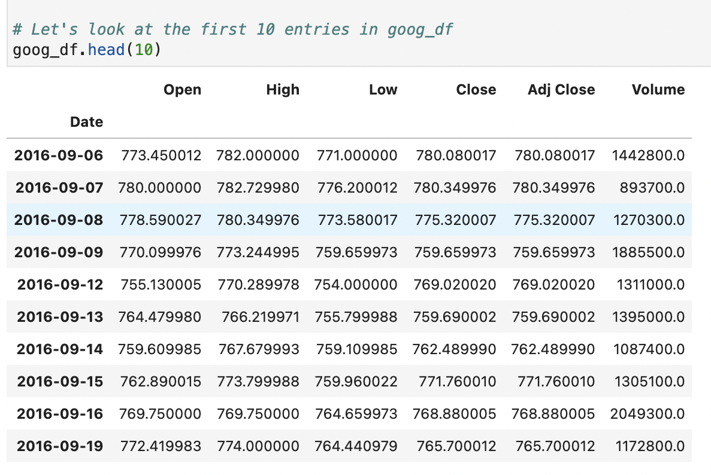

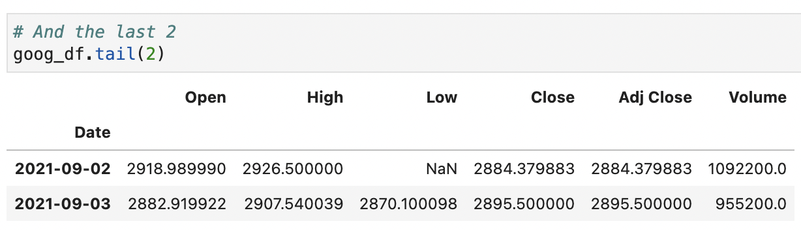

#### loc[] and iloc[]

We can single out a single Series within our DataFrame with square brackets, much as we would target a value in a Python dictionary by its key. For example, if we want to run `head()` on our **High** Series, we can do it with:

`goog_df["High"].head()`

But note that Pandas gives us two other useful methods that can help us single out one or more Series, or one or more rows. These are `loc[]` and `iloc[]`. Note that while this is a standard function, it uses square brackets `[]` instead of parenthesis `[]`; this aesthetic decision helps reinforce how similar this purpose of this function is to the typical column selection we just examined when targeting the **High** series.

With `loc[]`, we can provide up to two arguments indicating a selection of rows (and optionally, columns), in that order. For example, if we were looking to select all the rows from December 1st, 2020 on, we could use Python's colon (`:`) operator like so:

`goog_df.loc["2020-12-01":]`

If we wanted to see all entries up to January 29th, 2021, we would write:

`goog_df.loc[:"2021-01-29"]`

Or, to see only those entires between December 1st 2020 and January 29th, 2021, we would do:

`goog_df.loc["2020-12-01":"2021-01-29"]`

Finally, to see all rows, which somewhat defeats the purpose of using `loc[]`, we'll do:

`goog_df.loc[:]`

If we wanted to see all rows in `goog_df`, but only view the columns between **Open** and **Adj Close** (the latter of which we'll discuss shortly), we can run the following:

`goog_df.loc[:, "Open":"Close"]`

Because the first argument will always refer to our rows, while the second will refer to our columns, we'll need to indicate that we want to select all rows with `:`, then mark our the selected columns we want with `"Open":"Close"`, which would return all columns in our DataFrame listed between **Open**  and **Close**. If we only want to select all rows for one column, such as **Volume**, we would write:

`goog_df.loc[:, "Volume"]`

Or the values under "High" from our date slice above, we would run:

`goog_df.loc["2020-12-01":"2021-01-29", "High"]`

![goog_df.loc["2020-12-01":"2021-01-29", "High"]](Assets/JupyterLabs/goog_df_202012_202101.png)

Of course, we separate our row and column arguments with a comma (`,`). 

Remember, if we only entered `goog_df.loc["Open":"Close"]`, Pandas would try to find *rows* with the names "Open" and "Close", and would throw us an error upon not finding any. Since we want all columns, we don't have to provide a second argument. It is only when we want **all rows and some columns** that we need to provide both arguments, i.e. `.loc[:, "First Column Name":"Last Column Name"]`.

We can also assign this selection to a new variable. Let's create a new variable with the name `goog_df_from_2020` which selects only those entries from January 1st, 2020 and on:

`goog_df_from_2020 = goog_df.loc["2020-12-01":""2021-01-29"]`

Finally, `iloc[]` is similar to `loc[]`, except that we can use integers to indicate rows and columns. In this case, since our first row is **2020-01-02** and our first Series has a header of **Open**, we would indicate these with the integer `0`. **2020-01-03** and **High** would be indicated with `1`, and so on.

Let's check out the first row of our original DataFrame using `iloc()`, we can use:

`goog_df.iloc[0].head()`

![goog_df.iloc[0].head()](Assets/JupyterLabs/jupyter_iloc_head.png)

#### describe()

Finally, we can view some useful data about our selection with the `describe()` method. Let's use it on our new `goog_df_from_2020` DataFrame with:

`goog_df_from_2020.describe()`

Here, we can examine the total **count** of values, the **mean** (or average), the standard deviation in **std**, as well as an assortment of percentiles. Note that we can also run this on an individual Series or a grouping of Series and rows, chaining then to a `loc[]` or `iloc[]` method like so:

`goog_df_from_2020.loc[:, "Close"].describe()`

![goog_df_from_2020.loc[:, "Close"].describe()](Assets/JupyterLabs/goog_df_from_2020_open_close_describe.png)

### Trimming our DataFrames <a id="trimmingdataframes"></a>

Looks good! But we can organize this a little better.

For example, let's check out that **Adj Close**. A stock's opening price indicates the first sell price of the day, while its closing price indicates the last. But what's an adjusted close price? Sometimes, there can be a discrepancy after closing between the last transaction price of the day and the worth of a stock after certain corporate activity post-close. To learn more, reference [Investopedia's article on the adjusted price](https://www.investopedia.com/terms/a/adjusted_closing_price.asp). For now, let's just see if there are any differences in our Data between listed **Close** prices and **Adj Close** price.

We can do that by generating a list of boolean values that inform us of whether or not each row's value under the **Close** column is different from its respective value in the **Adj Close** column, and assigning it to a variable. We'll write:

`goog_2020_close_adjust_diff = goog_df_from_2020["Close"] != goog_df_from_2020["Adj Close"]`

Let's take a look at how many are different. If there are any differences between these two values, we'll see them represented in our boolean list with `True`. Let's generate a tally of all `True` values with:

`goog_2020_close_adjust_diff.value_counts()`

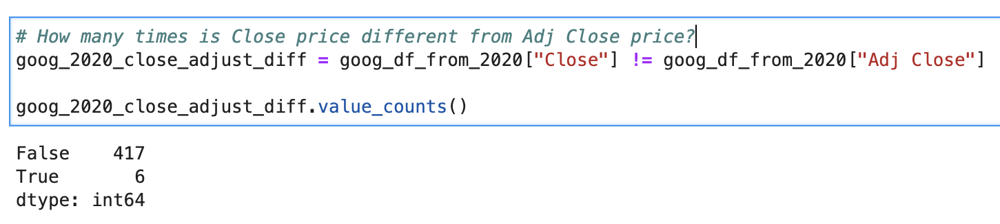

Interesting; there are 6 `True` values. Let's take a peek at those rows by passing our boolean list to `goog_df_from_2020` within square brackets, like so:

`goog_df_from_2020[goog_2020_close_adjust_diff]`

![goog_df_from_2020[goog_2020_close_adjust_diff]](Assets/JupyterLabs/goog_df_from_2020_with_cl_adjcl_diff.png)

Curiouser and curiouser. We see `NaN` values, indicating missing entries for the **Close** Series. This can happen at times. It's easy to assume that this means there aren't any differences between Close and Adj Close once these `NaN` values are accounted for, but there's always a possibility that these rows had values under **Adj Close** that were originally different from their equivalents in the **Close** column. To be safe, let's drop all rows with `NaN` in its **Adj Close** or **Close** column, so we can know that these divergences don't affect our broader analysis of the performace of this stock. We'll tell Pandas to drop all rows with `NaN` under **Close** and **Adj Close** with the following:

`goog_df_from_2020 = goog_df_from_2020.dropna(subset=["Close", "Adj Close"])`

We call `dropna()` and pass in a `subset` argument, set equal to a array of lists of the names of Series whose rows holding `NaN` values we'd like to drop. Note that even if we wanted to indicate a single Series, we would still contain it within an array, i.e.: `.dropna(subset=["Single Array"])`

Note that dropping rows with missing values isn't the only way to handle missing values, as we'll examine a moment. But for now, let's count the values on the differences between with **Close** and **Adj Close** the same way as we did before, and display the results:

```
goog_2020_close_adjust_diff = goog_df_from_2020["Close"] != goog_df_from_2020["Adj Close"]

goog_2020_close_adjust_diff.value_counts()
```

We should find no True values, which we can confirm with by using bracket notation again:

```
goog_df_from_2020[goog_2020_close_adjust_diff]
```
![goog_2020_close_adjust_diff and goog_df_from_2020[goog_2020_close_adjust_diff]](Assets/JupyterLabs/goog_df_from_2020_cl_adjcl_na_drop.png)

Alright, we can be confident there are no remaining discrepancies between our **Close** and **Adj Close** columns. To streamline our DataFrame, let's consolidate our two rows by simply dropping our **Adj Close** column.

`goog_df_from_2020 = goog_df_from_2020.drop(columns=["Adj Close"])`

We reassign the value of `goog_df_from_2020` to the result of calling `.drop()` on `goog_df_from_2020`, passing in the argument `columns` and setting it equal to a single-value array with a string of the column we want to drop.

![goog_df_from_2020 = goog_df_from_2020.drop(columns=["Adj Close"])](Assets/JupyterLabs/goog_df_from_2020_drop_adjcl.png)

#### isna() and sum()

Alternatively, if we want to count how many NaN values are in a Series, we can use `isna()`, chained with `sum()`. Let's count how many NaN values are in our **Volume** Series, which tracks how many shares were traded on a given day.

`goog_df_from_2020["Volume"].isna().sum()`

![goog_df_from_2020["Volume"].isna().sum()](Assets/JupyterLabs/goog_df_from_2020_vol_isna_sum.png)

Merely executing `goog_df_from_2020["Volume"].isna()` on its own will provide us with a Series of boolean values that hold `True` for an `NaN` value and `False` for a non-`NaN` value. By using `.sum()` afterwards, we'll get a count of all `True` values, in this case, three.

But rather than simply dropping the rows that have `NaN` values, let's take a look at another interesting feature of this Series by evaluating the `.dtype` property like so:

`goog_df_from_2020["Volume"].dtype`

#### dtype

`dtype` is a property, not a method, and thus we don't need to access it with parenthesis or square brackets. When we evaluate the results, we see that this Series contains floats, or numbers that have decimals. But just a cursory look at the Series shows us that most, if not all, of these floating-point numbers end with `.0`. After all, people don't sell or buy fractions of shares—they either buy and sell them in full or they don't.

Just to be sure, though, let's count how many of these values in our **Volume** series are cleanly divisible by 1 without any fractions in the quotient (that is, how many of these values, when divided by 1, equal 0); if they're all divisble by 1 with no remainder, then they're all full numbers, and would better be represented by integers. We'll run the following:

```
goog_df_vol_non_int = goog_df_from_2020["Volume"] % 1 != 0
goog_df_vol_non_int.sum()
```

We'll use modulus division (using `%`) to create a boolean list of values that mark `False` for full-number values (ending with `.0`) and `True` for all other numbers, then count the number of `True` results with .sum().

*Note: to clarify, if we were to run `7 % 1`, we would get `0`, because 7 divided by 1 equals 7, with no remainder. If we were to run `7 % 2`, we would get `1`, because 7 divided by 2 equals 3, with a remainder of 1. In the same way, if we run `7.5 % 1` we would get `.5`, because 7 divided by 1 equals 7, with a remainder of .5.*

We see that there are three values that are true. Let's examine them as before, by running:

`goog_df_from_2020[goog_df_vol_non_int]`

![goog_df_from_2020[goog_df_vol_non_int]](Assets/JupyterLabs/goog_df_from_2020_vol_dtype.png)

Again, they're all empty `NaN` values, so let's change that. This time, however, rather than dropping all rows with `NaN` values under "Volume", let's fill them with their average.

#### fillna()

Let's use the `fillna()` function to replace all `NaN` values with the mean value for our **Volume** column. Since so few rows have `NaN` values in under this column, we can replace them with the average volume traded for this stock without too much concern that drawing broader conclusions about the performance of this stock will be significantly impacted. Simply replacing them with the value `0` could be another solution, but doing so could bring the mean volume down; if enough rows had their **Volume** values replaced with such a low number, it could bring down the mean traded volume, which could make our analysis less accurate.

```
goog_df_from_2020_vol_mean = goog_df_from_2020["Volume"].mean()

goog_df_from_2020["Volume"] = goog_df_from_2020["Volume"].fillna(goog_df_from_2020_vol_mean)
```

Here, we create a variable called `goog_df_from_2020_vol_mean` to store the mean using the .mean() function, then call `fillna()` to replace all `NaN` values with `goog_df_from_2020_vol_mean`.

Because we have replaced all occurences of `NaN` with numbers, we can now convert all the values from floats to integers to better represent their values. Note that the averages we replaced `NaN` value with likely had a value other than `.0` at the end, but converting these values to integers will not be a problem; Pandas will simply remove everything after the decimal point. If we had left them as `NaN`, Pandas would have thrown an error—it's a powerful library, but it can't represent a value that's fundamentally "Not a Number" as a number!

We'll reassign the data type of all values in the "Volume" column with integers and view the results like so:

```
goog_df_from_2020["Volume"] = goog_df_from_2020["Volume"].astype("int")

goog_df_from_2020["Volume"].dtype
```

![goog_df_from_2020["Volume"] = goog_df_from_2020["Volume"].fillna(goog_df_from_2020_vol_mean) and goog_df_from_2020["Volume"] = goog_df_from_2020["Volume"].astype("int")](Assets/JupyterLabs/goog_df_from_2020_vol_fillna_astype_int.png)

We should see the output as `dtype('int64')`. Good work!

### Calculating with DataFrames <a id="calculatingwithdataframes"></a>

#### sort_values()

Now to get to the meat of the exercise: let's generate a new Series in our DataFrame that calculates the difference between each row's value under the **High** and **Low** columns. We can do that with the following:

`goog_df_from_2020["High/Low Split"] = goog_df_from_2020["High"] - goog_df_from_2020["Low"]`

We'll see that a new Series with a title of "High/Low Split" was generated, that calculates the difference between **High** and **Low**. We'll see, though that some `NaN` values are populated in this Series, as some of the values in our **High** and **Close** Series are `NaN`. Let's count how many are remaining in our DataFrame:

`goog_df_from_2020.isna().sum()`

![goog_df_from_2020["High/Low Split"] = goog_df_from_2020["High"] - goog_df_from_2020["Low"] and goog_df_from_2020.isna().sum()](Assets/JupyterLabs/goog_df_from_2020_h_l_split.png)

The remaining `NaN` values are in the single digits across all rows, so let's simply drop the rows that contain them, as they represent such an overall percentage of the data we work with. We could fill the values with their mean as we did with **Volume**, but if we want to evaluate the volatility of these stocks by calculating the difference between their daily highs and lows, simply replacing these values with the mean could give us an inaccurate picture of the results. For example, the mean in the **Low** column is "1794.868432", but if we were to replace the `NaN` for `2021-09-02`, the **High/Low Split** for that day would be `1131.631568`, which would be a dramatic departure from the previous and next days' split.

Let's drop all rows across all Series in our DataFrame with an `NaN` value with:

`goog_df_from_2020 = goog_df_from_2020.dropna()`

Let's check out the basic stats of our **High/Low Split** Series with `describe()`:

`goog_df_from_2020["High/Low Split"].describe()`

![goog_df_from_2020 = goog_df_from_2020.dropna() and goog_df_from_2020["High/Low Split"].describe()](Assets/JupyterLabs/goog_df_from_2020_dropna_h_l_split_describe.png)

We see the average of values in **High/Low Split** is `38.194108`. But take a look at the maximum value: `107.200074`! Let's see what day that was by creating a new series and sorting it with the `sort_values()` method, passing in the argument `ascending=False` in order to sort our values from highest to lowest. Note that setting `ascending` to `True`, or not adding this argument at all, would sort values from lowest to highest.

```
goog_df_from_2020_split_sorted = goog_df_from_2020["High/Low Split"].sort_values(ascending=False)

goog_df_from_2020_split_sorted
```

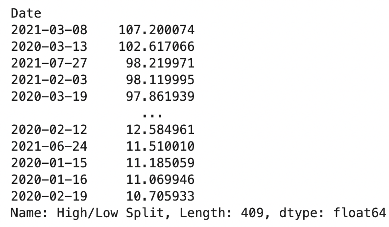

Here we see that the most volatile day between **High** and **Low** is on March 8th, 2021. We'll stick a pin in this for now, and evaluate some other points of interest regarding this information.

#### shift() and pct_change()

Let's say we want to see the difference between the values in our **Close** column and the day before. We could generate another column called **Close Price Change**, like so:

`goog_df_from_2020["Close Price Change"] = goog_df_from_2020["Close"] - goog_df_from_2020.shift()`

![goog_df_from_2020["Close Price Change"] = goog_df_from_2020["Close"] - goog_df_from_2020.shift()](Assets/JupyterLabs/goog_df_from_2020_cl_price.png)

If we examine `goog_df_from_2020` now, we'll see a new Close Price Change that tells us the difference in price between one day and the day before. Our `shift()` method tells Pandas to look at the previous value in the series we selected, in this case **Close**. Of course, our first row has `NaN` under our new column because there is no previous price to compare it against. Note that we can provide an integer as an argument to look at the value in whichever row we like; if we had passed `2` into `shift()`, that would be the equivalent of asking Pandas to compare each value to its analog two rows above.

We can also check out the percentage difference by adding a new Series called **Close Pct Change** with the following formula:

`goog_df_from_2020["Close Pct Change"] = goog_df_from_2020["Close Price Change"] / goog_df_from_2020["Close"]`

But we can accomplish the same goal with Pandas's `pct_change()` method, like so: 

`goog_df_from_2020["Close Pct Change"] = goog_df_from_2020["Close Price Change"].pct_change()`

![goog_df_from_2020["Close Pct Change"] = goog_df_from_2020["Close Price Change"].pct_change()](Assets/JupyterLabs/goog_df_from_2020_cl_pct.png)

Let's check out which day was our most profitable:

```
goog_df_from_2020_close_pct_sorted = goog_df_from_2020["Close Pct Change"].sort_values(ascending=False)

goog_df_from_2020_close_pct_sorted
```
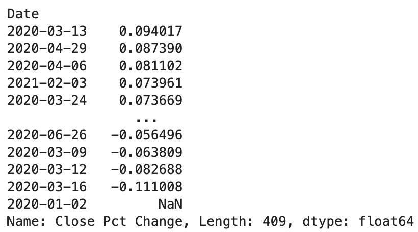

Looks like `GOOG` saw very robust growth in March and April of 2020, but also saw severe drops in that same period as well.

### Graphing our data <a id="graphingourdata"></a>

Here's the real magic trick: generating charts on the fly with Pandas! Visualizing data helps gives us a clearer image of trends. What's more, Pandas's `plot()` method is a breeze to use. We'll call that method on an individual Series, like so:

`goog_df_from_2020["Close"].plot()`

![goog_df_from_2020["Close"].plot()](Assets/JupyterLabs/goog_df_from_2020_cl_line.png)

Looks like `GOOG` has been soaring since the January 2020. But let's take a look at that `goog_df_from_2020_close_pct_sorted` Series we created earlier.

`goog_df_from_2020_close_pct_sorted.plot()`

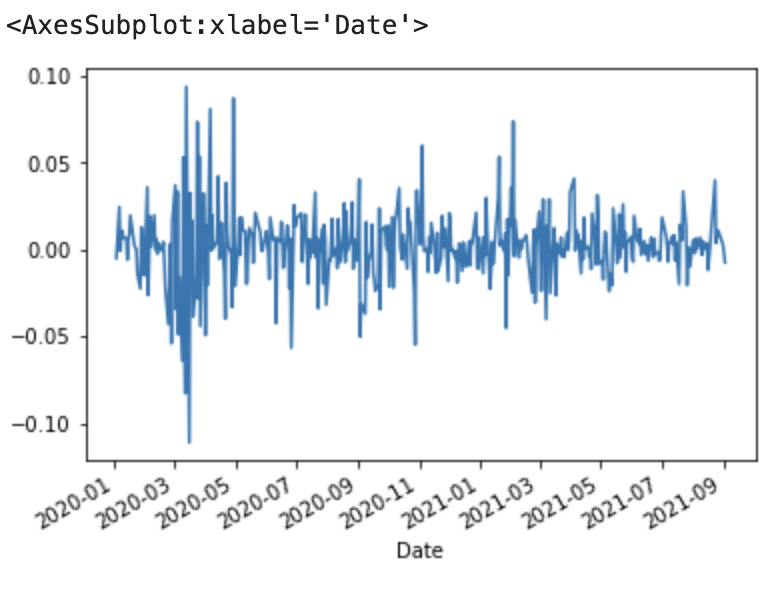

This conforms to our judgments from earlier—the greatest lurches upwards and downwards occured in March and April of 2020, gradually petering out in the subsequent months.

Let's check in on that `goog_df_from_2020_split_sorted` variable we created earlier, and examine it with a `hist` plot. This kind of chart allows us to see a bar graph of how often values generally appear.

`goog_df_from_2020_split_sorted.plot(kind="hist")`

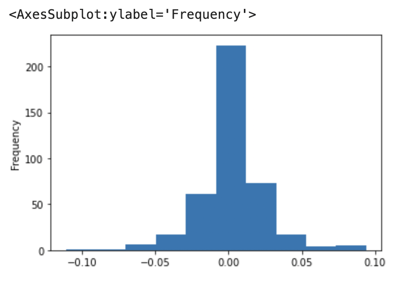

We can see that the most common values were just above 0, and those kinds of values occured just over 200 times. There's more frequent values occurrences to the right side of our horizontal axis, or *x-axis*, which conforms with what we know: that this stock has grown over time.

A different kind of chart that can provide valuable insight to the average occurence of individual values is the *box chart*. Rather than providing a total count of how often a price occurs in our data set, a box chart gives us insight into how frequent they occur relative to the average. Take a look for yourself:

`goog_df_from_2020_split_sorted.plot(kind="box")`

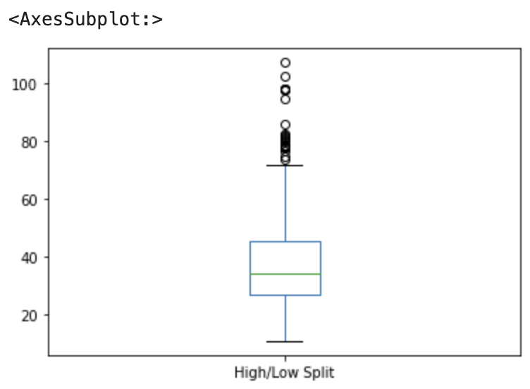

We can see a *box* with two lines, or *whiskers*, on either end; the upper limit of the whisker on top indicating the "maxmimum" value in our Series, and the bottom limit of the lower whisker indicated the "minimum" value. (We put *maximum* and *minimum* in quotations for a reason, as you'll see in the next paragraph.) The top of the rectangle at the middle points to the third quartile, while the bottom of the rectangle represents the lower quartile. The central line indicates the mean, or second quartile. Often, you'll hear the area between the first and third quartiles referred to as the *inter-quartile range*, or IQR. By executing `goog_df_from_2020_split_sorted.describe()`, we can confirm these values with exact number figures. 

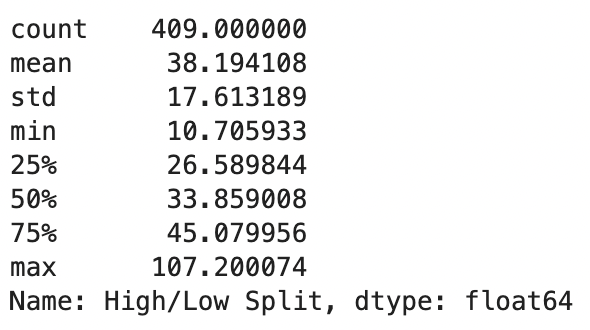

But wait, why is the "maximum" value on our box chart at around 70, while the greatest value is at `107.200074`? That's because the "maximum" and "minimum" in a box chart mark don't *necessarily* mark absolute highest and lowest values in the series. Instead, the "maximum" value of the upper whisker marks the value of the third quartile, plus the size of the IQR, multiplied by 1.5. If the difference between the first and third quartile is 18.490112, and that value multiplied by 1.5 is 27.735168, then the "maximum" line for our whisker will be 72.815124, just where our upper whisker is. The "minimum" will likeise be the first quartile minus 27.735168, which makes a negative number; since our lowest value is 10.705933, our lower whisker bottoms out there instead. Any values which exceed the whisker maximum or minimum are represented with dots above the upper and below the lower whiskers respectively; we can see an abundance of outlier days where volatility exceeded the upper bounds of our higher whisker.

Finally, let's compare `GOOG`'s performance to another stock, `ADBE`. We'll import the CSV the same as before, and trim to only those values from January 1st, 2020 onward. Finally, we'll check to see how many `NaN` values we have to see if there's anything to trim.

```
adbe_csv_path = Path('../Datasets/ADBE.csv')
adbe_df = pd.read_csv(adbe_csv_path,
                     index_col="Date",
                     parse_dates=True,
                     infer_datetime_format=True
                     )

adbe_df_from_2020 = adbe_df.loc["2020-01-01":]

adbe_df_from_2020.isna().sum()
```

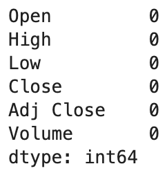

Thank goodness—no empty values! And since we `infer_datetime_format`, Pandas can determine month, date and year from our **Date** Series, even though it's written differently in `ADBE.csv` than it is in `GOOG.csv`. Let's add **High/Low Split**, **Close Price Change** and **Close Pct Change** columns as we did with our `GOOG` Series. As a practice, let's try out `loc[]` again when assigning our values.

```
adbe_df_from_2020.loc[:, "High/Low Split"] = adbe_df_from_2020["High"] - adbe_df_from_2020["Low"]

adbe_df_from_2020.loc[:, "Close Price Change"] = adbe_df_from_2020["Close"] - adbe_df_from_2020["Close"].shift()

adbe_df_from_2020.loc[:, "Close Pct Change"] = adbe_df_from_2020["Close"].pct_change()
```

If we want to compare their closing price performace, we can stack two `plot()` statements on top of each other, and see a line chart with both values:

```
goog_df_from_2020["Close"].plot()
adbe_df_from_2020["Close"].plot()
```

![goog_df_from_2020["Close"].plot() and adbe_df_from_2020["Close"].plot()](Assets/JupyterLabs/goog_adbe_cl_plot.png)

This looks OK... but it's difficult to tell what exactly we're seeing without further context. Examining [Pandas documentation for plots](https://pandas.pydata.org/docs/reference/api/pandas.DataFrame.plot.html) in general as well as [line plots](https://pandas.pydata.org/docs/reference/api/pandas.DataFrame.plot.line.html) in particular, we can see the different arguments that a line chart can take. Let's use some of them in our chart!

```
goog_df_from_2020["Close"].plot(legend=True, color="red", label="GOOG", title="GOOG vs. ADBE")
adbe_df_from_2020["Close"].plot(legend=True, color="green", label="ADBE")
```

![goog_df_from_2020["Close"].plot(legend=True, color="red", label="GOOG", title="GOOG vs. ADBE") and adbe_df_from_2020["Close"].plot(legend=True, color="green", label="ADBE")](Assets/JupyterLabs/goog_adbe_cl_plot_labelled.png)

We add `legend` and set it to `True` to display a chart legend with information about which color represents which stock, as well as a `title` which we created to provide context about what information we're looking at.

One more thing: in absolute numbers, `GOOG` is certainly more valuable a stock than `ADBE`. But does that necessarily mean that $1000 invested in January in `GOOG` would be more valuable today than the same amount invested in `ADBE`? Let's give one `ADBE` an argument in its `plot` method, called `secondary_y` and set it to `True` to find out!

(And while we're at it, let's pass `figsize=(20, 15)` to make it easier to read! It takes a value of an x-axis size and a y-axis size within parenthesis. Feel free to adjust the numbers to your liking.)

Let's use the following:

```
ax_goog = goog_df_from_2020["Close"].plot(legend=True, color="red", label="GOOG", title="GOOG vs. ADBE", figsize=(20, 15))
ax_adbe = adbe_df_from_2020["Close"].plot(legend=True, color="green", label="ADBE", secondary_y=True)

ax_goog.set_ylabel("Share Value for GOOG")
ax_adbe.set_ylabel("Share Value for ADBE")
```

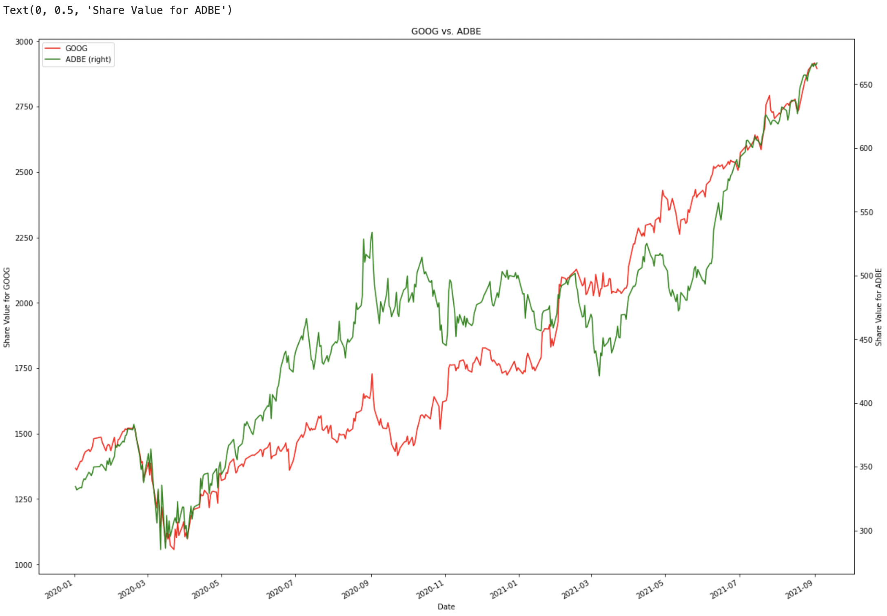

We'll note that since `plot()` can return a chart that can be stored in a variable, we'll use this functionality so that we can call a method called `set_ylabel()` on the resultant variables and pass in a y-axis label on each side of the chart.

Here we see the two lines overlapping, allowing us to examine relative performance of each stock without consideration to their absolute price. And guess what—it looks like that `ADBE` may have a slight edge here! `ADBE` started out relatively lower in value by comparison to its current price, relative to what we see in `GOOG`. Indeed, throughout most of 2020, ADBE strongly outperformed `GOOG` in relative terms. Perhaps first glances aren't always what they appear!

## Solution <a id="solution"></a>

To see a completed version of this project, navigate to the `Unsolved/Notebooks/` and open `Time_Series_Analysis.ipynb` from JupyterLab.

## What's Next? <a id="whatsnext"></a>

Whew! That was a lot. But we accomplished so much, from importing a CSV file, arranging a resultant DataSet and displaying compelling charts that gave us real insight about the performance of these assets. We can use these skills going forward and evaluate other stocks, cryptocurrencies or other financial instruments.

Feel free to look into other Python libraries that complement Pandas, such as [matplotlib](https://matplotlib.org/) [seaborn](http://seaborn.pydata.org/index.html)! These libraries are used by FinTech professionals, as well as Data Visualization experts of every kind, to help make sense of numbers just like we did today.

Feel proud of yourself—you mastered a difficult challenge, and learned a lot a long the way!